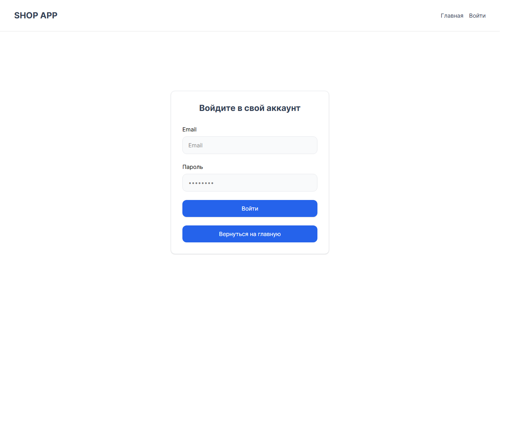
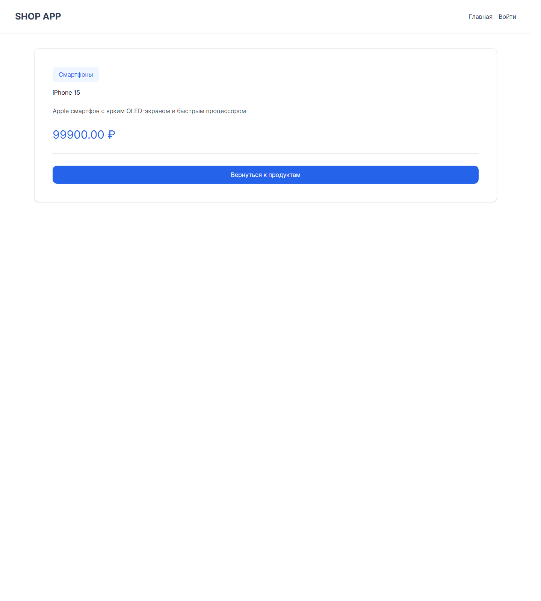
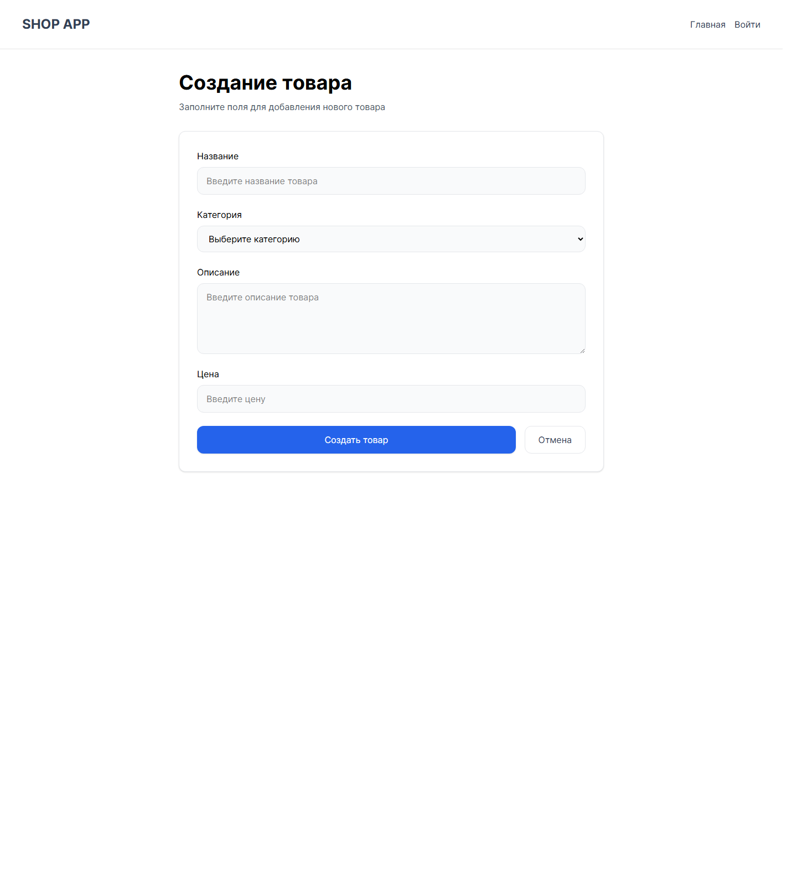
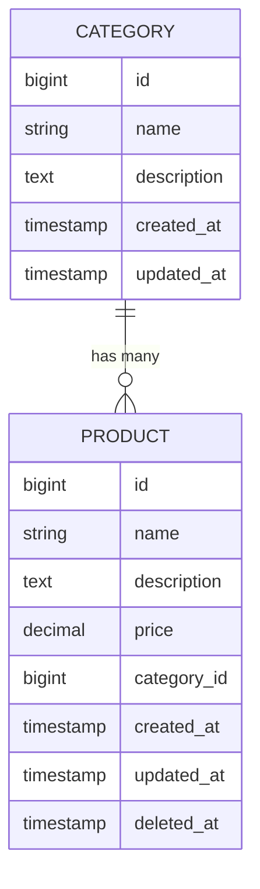

# Shop App

Тестовое задание для позиции Junior Full-Stack Developer: каталог товаров с публичной частью, административным управлением, REST API на Laravel и SPA-интерфейсом на Vue 3 + Inertia.js.

## О проекте

Приложение реализует:

- публичный каталог товаров;
- просмотр карточки отдельного товара;
- фильтрацию по категориям;
- поиск по товарам;
- серверную пагинацию;
- авторизацию администратора через Laravel Sanctum;
- создание, редактирование, удаление и восстановление товаров;
- запуск как локально, так и через Docker.

Проект сделан в соответствии с ТЗ на стек `Laravel + Vue 3 + InertiaJS + PostgreSQL`.

---

## Скриншоты интерфейса

### Страница авторизации



### Страница товара



### Форма создания товара



---

## Что реализовано

### Backend

- модели `Product` и `Category`;
- связь:
  - `Product belongsTo Category`
  - `Category hasMany Product`
- миграции для:
  - категорий;
  - товаров;
  - Sanctum-токенов;
  - soft delete для товаров;
- REST API для товаров и категорий;
- токен-авторизация администратора через Sanctum;
- `FormRequest`-валидация для create/update;
- `API Resource` для выдачи данных;
- eager loading категории в товарах;
- корректные HTTP-коды:
  - `200` для успешных чтений;
  - `201` для создания;
  - `401` для неавторизованных запросов;
  - `422` для ошибок валидации.

### Frontend

- Vue 3 Composition API;
- Inertia.js для клиентских страниц;
- Pinia для состояния;
- composables для работы с API;
- публичная главная страница `/`;
- страница товара `/product/{id}`;
- поиск с debounce;
- фильтр по категориям;
- серверная пагинация по 10 товаров на страницу;
- страница логина `/login`;
- админ-страница `/admin/products`;
- форма создания `/admin/products/create`;
- форма редактирования `/admin/products/{id}/edit`;
- модалка подтверждения удаления;
- показ soft-deleted товаров по чекбоксу;
- восстановление удаленных товаров.

### Бонусные пункты

- Docker + Docker Compose;
- seeders;
- soft deletes;
- тесты;
- composables `useAuthApi`, `useProductsApi`, `useCategoriesApi`;
- более подробный README со структурой и инструкцией запуска.

---

## Соответствие тестовому заданию

| Пункт | Статус | Комментарий |
|---|---|---|
| Product / Category модели и связи | Done | Eloquent relationships реализованы |
| `GET /api/products` | Done | С пагинацией, категорией, поиском и фильтрацией |
| `GET /api/products/{id}` | Done | Возвращает один товар с категорией |
| `POST /api/products` | Done | Требует авторизацию |
| `PUT/PATCH /api/products/{id}` | Done | Требует авторизацию |
| `DELETE /api/products/{id}` | Done | Требует авторизацию, используется soft delete |
| `GET /api/categories` | Done | Публичный список категорий |
| `POST /api/login` | Done | Возвращает Sanctum token |
| Валидация товара | Done | Через `StoreProductRequest` и `UpdateProductRequest` |
| Главная страница каталога | Done | Список, поиск, фильтр, пагинация |
| Страница товара | Done | Подробная информация |
| Авторизация администратора | Done | Токен хранится в `localStorage` |
| CRUD в админке | Done | Создание, редактирование, удаление, восстановление |
| PostgreSQL | Done | Используется и локально, и в Docker |
| Docker | Done | Отдельные сервисы app, vite, db |
| Seeders | Done | 6 категорий и 30 товаров |
| Tests | Done | Feature tests для API и логина |

---

## Технологии

### Backend

- PHP 8.2+
- Laravel 12
- Laravel Sanctum
- Eloquent ORM
- Form Requests
- API Resources

### Frontend

- Vue 3.5
- Inertia.js
- Pinia
- Axios
- Tailwind CSS 4
- Vite 7

### Database

- PostgreSQL

### Infrastructure

- Docker
- Docker Compose

---

## Архитектура проекта

### База данных



### Архитектурные решения

- backend и frontend разделены логически;
- API-часть Laravel находится в `app/Http/Controllers/Api`;
- правила валидации вынесены в `FormRequest`;
- формат ответа API оборачивается в `Resource`;
- frontend разделен на:
  - `Pages` для страниц;
  - `Components` для UI-компонентов;
  - `store` для состояния;
  - `composables` для API-взаимодействия;
- токен авторизации автоматически подставляется в заголовки через `useApiClient`;
- пагинация реализована на API, а UI только переключает страницы;
- удаление реализовано через soft delete, чтобы товар можно было восстановить.

---

## Структура проекта

```text
shop-app/
├── app/
│   ├── Http/
│   │   ├── Controllers/Api/
│   │   │   ├── AuthController.php
│   │   │   ├── CategoryController.php
│   │   │   └── ProductController.php
│   │   ├── Requests/
│   │   │   ├── LoginRequest.php
│   │   │   ├── StoreProductRequest.php
│   │   │   └── UpdateProductRequest.php
│   │   └── Resources/
│   │       ├── CategoryResource.php
│   │       └── ProductResource.php
│   └── Models/
│       ├── Category.php
│       ├── Product.php
│       └── User.php
├── database/
│   ├── migrations/
│   └── seeders/
│       ├── CategorySeeder.php
│       ├── ProductSeeder.php
│       └── UserSeeder.php
├── docker/
│   └── entrypoint.sh
├── docs/
│   └── screenshots/
├── resources/
│   ├── css/
│   └── js/
│       ├── Components/
│       ├── Layouts/
│       ├── Pages/
│       ├── composables/
│       └── store/
├── routes/
│   ├── api.php
│   └── web.php
├── tests/
│   └── Feature/
│       └── ProductApiTest.php
├── Dockerfile
├── docker-compose.yml
└── README.md
```

---

## Основные пользовательские сценарии

### Публичная часть

1. Открыть `/`
2. Просмотреть каталог товаров
3. Выполнить поиск по названию или описанию
4. Отфильтровать товары по категории
5. Переключить страницы пагинации
6. Открыть детальную страницу товара

### Администратор

1. Открыть `/login`
2. Войти под админом
3. Перейти в `/admin/products`
4. Создать новый товар
5. Отредактировать существующий товар
6. Удалить товар через модалку подтверждения
7. При необходимости включить показ удаленных товаров
8. Восстановить удаленный товар

---

## Тестовые данные

После сидирования создаются:

- 1 администратор;
- 6 категорий;
- 30 товаров.

### Данные администратора

```text
Email: admin@example.com
Password: password
```

### Категории

- Смартфоны
- Ноутбуки
- Аксессуары
- Планшеты
- Аудио
- Мониторы

### Пагинация

- всего товаров: `30`
- товаров на странице: `10`
- всего страниц: `3`

---

## API endpoints

### Аутентификация

| Метод | URL | Описание | Auth |
|---|---|---|---|
| `POST` | `/api/login` | Логин администратора | No |
| `POST` | `/api/logout` | Выход | Yes |

### Категории

| Метод | URL | Описание | Auth |
|---|---|---|---|
| `GET` | `/api/categories` | Список категорий | No |

### Товары

| Метод | URL | Описание | Auth |
|---|---|---|---|
| `GET` | `/api/products` | Список товаров с пагинацией | No |
| `GET` | `/api/products/{id}` | Один товар | No |
| `POST` | `/api/products` | Создать товар | Yes |
| `PUT` | `/api/products/{id}` | Обновить товар | Yes |
| `PATCH` | `/api/products/{id}` | Частично обновить товар | Yes |
| `DELETE` | `/api/products/{id}` | Удалить товар | Yes |
| `POST` | `/api/products/{id}/restore` | Восстановить товар | Yes |

### Query params для `/api/products`

| Параметр | Описание |
|---|---|
| `page` | номер страницы |
| `category_id` | фильтр по категории |
| `search` | поиск по названию и описанию |
| `checkDeleted=1` | показать soft-deleted товары |

### Примеры запросов

Логин:

```bash
curl -X POST http://127.0.0.1:8000/api/login \
  -H "Content-Type: application/json" \
  -d "{\"email\":\"admin@example.com\",\"password\":\"password\"}"
```

Получение первой страницы товаров:

```bash
curl "http://127.0.0.1:8000/api/products?page=1"
```

Поиск товара:

```bash
curl "http://127.0.0.1:8000/api/products?search=iphone"
```

---

## Валидация

Для создания и обновления товара:

- `name` — обязательное строковое поле;
- `description` — необязательное строковое поле;
- `price` — обязательное числовое поле, строго больше `0`;
- `category_id` — обязательное поле, категория должна существовать в БД.

---

## Как запустить локально

### 1. Предварительные требования

Нужно установить:

- PHP 8.2+
- Composer
- Node.js 20+
- npm
- PostgreSQL

### 2. Клонировать проект и перейти в папку

```bash
git clone <repo-url>
cd shop-app
```

### 3. Установить зависимости

```bash
composer install
npm install
```

### 4. Подготовить `.env`

Если файла `.env` нет:

```bash
cp .env.example .env
```

Используемые настройки БД:

```env
DB_CONNECTION=pgsql
DB_HOST=127.0.0.1
DB_PORT=5432
DB_DATABASE=shop
DB_USERNAME=postgres
DB_PASSWORD=1234
```

### 5. Создать базу данных PostgreSQL

Нужно создать базу:

```sql
CREATE DATABASE shop;
```

### 6. Сгенерировать ключ приложения

```bash
php artisan key:generate
```

### 7. Применить миграции

```bash
php artisan migrate
```

### 8. Заполнить тестовые данные

```bash
php artisan db:seed --class=UserSeeder
php artisan db:seed --class=ProductSeeder
```

### 9. Запустить backend

```bash
php artisan serve
```

Laravel будет доступен по адресу:

```text
http://127.0.0.1:8000
```

### 10. Запустить frontend

В отдельном терминале:

```bash
npm run dev
```

Vite dev server будет доступен по адресу:

```text
http://127.0.0.1:5173
```

---

## Как запустить через Docker

### 1. Предварительные требования

Нужно установить:

- Docker Desktop
- Docker Compose

### 2. Запуск проекта

```bash
docker compose up --build
```

После запуска будут подняты 3 сервиса:

- `app` — Laravel backend;
- `vite` — Vite dev server;
- `db` — PostgreSQL.

### 3. Доступные адреса

```text
Laravel: http://127.0.0.1:8000
Vite:    http://127.0.0.1:5173
DB:      127.0.0.1:5432
```

### 4. Что происходит автоматически внутри Docker

Контейнер `app` сам выполняет:

- `composer install`
- ожидание готовности PostgreSQL
- `php artisan migrate --force`
- сидирование администратора
- сидирование товаров, если таблица пуста
- запуск Laravel server

### 5. Полезные Docker-команды

Запустить проект:

```bash
docker compose up -d
```

Остановить проект:

```bash
docker compose down
```

Пересобрать контейнеры:

```bash
docker compose build --no-cache
docker compose up -d
```

Перезаполнить админа:

```bash
docker compose exec app php artisan db:seed --class=UserSeeder --force
```

Пересоздать демо-товары:

```bash
docker compose exec app php artisan db:seed --class=ProductSeeder --force
```

Запустить тесты в Docker:

```bash
docker compose exec app php artisan test
```

---

## Тестирование и проверка качества

### Backend tests

В проекте есть feature-тесты:

- логин пользователя;
- создание товара авторизованным администратором;
- запрет создания товара гостем;
- проверка ошибок валидации.

Запуск:

```bash
php artisan test
```

Или в Docker:

```bash
docker compose exec app php artisan test
```
Результаты тестирования:
  PASS  Tests\Unit\ExampleTest
  ✓ that true is true              0.80s  

   PASS  Tests\Feature\ExampleTest
  ✓ the application returns a successful response       12.36s  

   PASS  Tests\Feature\ProductApiTest
  ✓ user can login                         2.20s  
  ✓ authenticated admin can create product    0.47s  
  ✓ guest cannot create product                        0.01s  
  ✓ product validation fails with invalid data      0.16s  

  Tests:    6 passed (17 assertions)
  Duration: 23.00s

### Production build frontend

```bash
npm run build
```

---

## Что особенно важно для ревьюера

Если проверять проект как тестовое, рекомендую пройтись по этому сценарию:

1. открыть каталог `/`;
2. проверить поиск по `iphone`;
3. выбрать категорию и убедиться, что список фильтруется;
4. переключить страницы пагинации;
5. открыть страницу товара;
6. залогиниться под `admin@example.com / password`;
7. перейти в `/admin/products`;
8. создать новый товар;
9. отредактировать товар;
10. удалить товар;
11. включить чекбокс показа удаленных товаров;
12. восстановить товар.

Этот сценарий покрывает почти все пункты ТЗ.

---

## Ключевые особенности реализации

- API и UI разделены, но связаны через Inertia и composables;
- используется PostgreSQL, как требовалось в задании;
- поиск работает с debounce и не спамит API;
- пагинация реализована на стороне сервера;
- авторизация реализована на токенах Sanctum;
- soft delete позволяет не терять данные;
- seeders сразу подготавливают проект к демонстрации;
- Docker-конфигурация позволяет поднять проект одной командой.

---

## Возможные дальнейшие улучшения

Если развивать проект дальше, можно добавить:

- сортировку товаров;
- загрузку изображений товара;
- swagger / openapi документацию;
- полноценные e2e тесты;
- более строгую роль `admin` через policy / middleware;
- деплой на VPS или Render / Railway.

---

## Итог

Этот проект закрывает основное тестовое задание по `Laravel + Vue 3 + InertiaJS + PostgreSQL` и дополнительно содержит Docker, тесты, soft deletes и сидеры, что делает его удобным для демонстрации и проверки.

Если открыть репозиторий, reviewer сразу увидит:

- понятную структуру;
- соответствие ТЗ;
- готовые команды запуска;
- тестовые данные;
- реальные скриншоты интерфейса.
